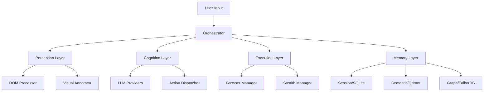

# 🚀 AI-First Smart Browser - What Else We Need

## 📊 Current Status
**Good news!** Core implementation files exist:
- ✅ 20+ Python files in src/
- ✅ Browser management, stealth, perception layers implemented
- ✅ LLM providers (OpenAI, Anthropic, Gemini) ready
- ✅ Configuration optimized for Claude Code

## 🔴 Critical Missing Components

### 1. **Test Infrastructure** 🧪
Currently have only `conftest.py`. Need:
```python
tests/
├── unit/
│   ├── test_browser_manager.py
│   ├── test_stealth_manager.py
│   ├── test_dom_processor.py
│   └── test_llm_providers.py
├── integration/
│   ├── test_browser_perception.py
│   ├── test_llm_integration.py
│   └── test_memory_layer.py
├── stealth/
│   ├── test_bot_detection.py
│   └── test_fingerprinting.py
└── e2e/
    └── test_complete_workflow.py
```

### 2. **CI/CD Pipeline** 🔄
Need `.github/workflows/`:
```yaml
# .github/workflows/ci.yml
name: CI
on: [push, pull_request]
jobs:
  test:
    runs-on: ubuntu-latest
    steps:
      - uses: actions/checkout@v3
      - uses: actions/setup-python@v4
      - run: |
          pip install -r requirements.txt
          pytest tests/
  
  quality:
    runs-on: ubuntu-latest
    steps:
      - run: ruff check src/
      - run: mypy src/ --strict
```

### 3. **Memory Layer Implementation** 💾
Currently missing in `src/memory/`:
```python
# src/memory/session_memory.py
class SessionMemory:
    """SQLite-based short-term memory"""
    
# src/memory/semantic_memory.py
class SemanticMemory:
    """Qdrant vector database integration"""
    
# src/memory/knowledge_graph.py
class KnowledgeGraph:
    """FalkorDB graph operations"""
```

### 4. **Plugin System** 🔌
Need `src/extensibility/`:
```python
# src/extensibility/plugin_manager.py
class PluginManager:
    """Dynamic plugin loading and management"""
    
# src/extensibility/plugin_interface.py
class IPlugin(ABC):
    """Base plugin interface"""
```

### 5. **Logging & Monitoring** 📈
```python
# src/common/logger.py
from loguru import logger

logger.add(
    "logs/app.log",
    rotation="10 MB",
    retention="7 days",
    level="INFO"
)

# src/common/metrics.py
from prometheus_client import Counter, Histogram

action_counter = Counter('browser_actions', 'Total browser actions')
llm_latency = Histogram('llm_response_time', 'LLM response time')
```

### 6. **Error Recovery System** 🛡️
```python
# src/common/recovery.py
class RecoveryManager:
    def __init__(self):
        self.checkpoints = []
        self.rollback_strategies = {}
    
    async def create_checkpoint(self):
        """Save current state"""
    
    async def rollback(self):
        """Restore to last checkpoint"""
```

### 7. **Documentation** 📚
Need:
- API documentation (Sphinx/MkDocs)
- Architecture diagrams (Mermaid/Draw.io)
- Usage examples
- Video tutorials

### 8. **Security Enhancements** 🔐
```python
# src/common/security.py
class SecurityManager:
    """Handle secrets, sanitization, validation"""
    
    def sanitize_input(self, text: str) -> str:
        """Remove sensitive data"""
    
    def validate_url(self, url: str) -> bool:
        """Validate safe URLs"""
```

### 9. **Performance Benchmarks** ⚡
```python
# benchmarks/performance.py
import time
from hyperfine import benchmark

def benchmark_browser_init():
    """Measure browser initialization time"""

def benchmark_dom_processing():
    """Measure DOM extraction speed"""
```

### 10. **Database Migrations** 🗄️
```sql
-- migrations/001_initial_schema.sql
CREATE TABLE conversations (
    id INTEGER PRIMARY KEY,
    task_id TEXT NOT NULL,
    timestamp DATETIME DEFAULT CURRENT_TIMESTAMP
);

-- migrations/002_add_actions.sql
CREATE TABLE actions (
    id INTEGER PRIMARY KEY,
    conversation_id INTEGER,
    action_type TEXT
);
```

## 🎯 Priority Order

### Week 1 - Foundation
1. **Test Suite** - Write core unit tests
2. **Memory Layer** - Implement SQLite session memory
3. **Logging** - Set up structured logging

### Week 2 - Integration
1. **CI/CD** - GitHub Actions pipeline
2. **Plugin System** - Basic plugin loading
3. **Error Recovery** - Checkpoint system

### Week 3 - Advanced
1. **Vector Memory** - Qdrant integration
2. **Knowledge Graph** - FalkorDB integration
3. **Security** - Input sanitization

### Week 4 - Polish
1. **Documentation** - API docs with Sphinx
2. **Performance** - Benchmarking suite
3. **Examples** - Usage demonstrations

## 🛠️ Quick Start Commands

```bash
# Create test structure
mkdir -p tests/{unit,integration,stealth,e2e}

# Create memory layer
mkdir -p src/memory
touch src/memory/{__init__,session_memory,semantic_memory,knowledge_graph}.py

# Create GitHub Actions
mkdir -p .github/workflows
touch .github/workflows/{ci.yml,cd.yml,security.yml}

# Create documentation
mkdir -p docs/{api,guides,examples}
touch mkdocs.yml
```

## 📦 Additional Dependencies Needed

Add to `requirements.txt`:
```txt
# Monitoring
prometheus-client==0.19.0
opentelemetry-api==1.22.0

# Documentation
mkdocs==1.5.3
mkdocstrings==0.24.0
mkdocs-material==9.5.3

# Security
bandit==1.7.5
safety==3.0.1

# Database
alembic==1.13.1  # For migrations
```

## 🔄 Development Workflow Enhancement

### Add to Makefile:
```makefile
docs: ## Generate API documentation
	mkdocs build

serve-docs: ## Serve documentation locally
	mkdocs serve

security-scan: ## Run security checks
	bandit -r src/
	safety check

benchmark: ## Run performance benchmarks
	python benchmarks/performance.py

migrate: ## Run database migrations
	alembic upgrade head
```

## 🎨 Architecture Diagram Needed



## 💡 Advanced Features to Consider

1. **WebSocket Support** - Real-time browser events
2. **Distributed Execution** - Multi-browser orchestration
3. **Visual Debugging** - Browser session recording
4. **A/B Testing** - Strategy comparison
5. **Prompt Optimization** - Auto-tune prompts
6. **Cost Tracking** - LLM usage analytics
7. **Rate Limiting** - API throttling
8. **Caching Layer** - Redis for responses
9. **Webhook Integration** - External notifications
10. **Dashboard UI** - Web interface for monitoring

## 📈 Success Metrics to Track

- Test coverage > 80%
- Response time < 5s (p95)
- Success rate > 95%
- Memory usage < 500MB
- Container health 100%

## 🏁 Definition of "Production Ready"

- [ ] All tests passing
- [ ] CI/CD pipeline active
- [ ] Documentation complete
- [ ] Security scan passed
- [ ] Performance benchmarks met
- [ ] Error recovery tested
- [ ] Memory layer operational
- [ ] Monitoring enabled
- [ ] Examples provided
- [ ] Video tutorial created

---
**Estimated Time**: 4 weeks with focused development
**Team Size**: 1-2 developers
**Complexity**: Medium-High