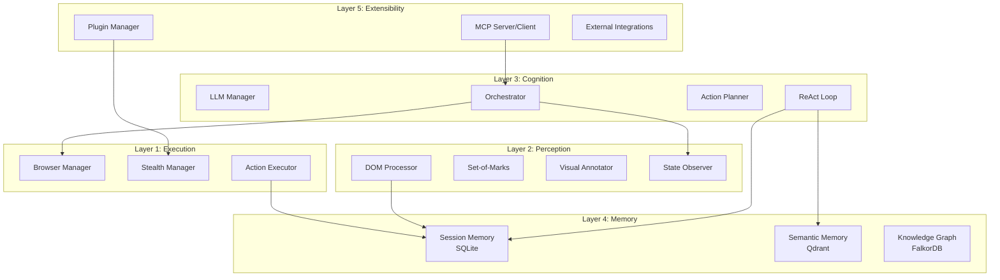

# Architecture Overview

The AI-First Smart Browser implements a sophisticated 5-layer architecture designed for scalability, maintainability, and production reliability. Each layer has distinct responsibilities and well-defined interfaces.

## Architectural Principles

### 🎯 **Separation of Concerns**
Each layer handles a specific aspect of the system:
- **Execution**: Browser control and stealth operations
- **Perception**: State capture and multi-modal analysis
- **Cognition**: AI reasoning and decision making
- **Memory**: Multi-tier storage and retrieval
- **Extensibility**: Plugin system and external integrations

### 🔄 **Unidirectional Data Flow**
Information flows primarily downward through the layers:
```
Cognition → Perception → Execution
    ↓           ↓           ↓
         Memory ← ← ← ←
```

### 🔌 **Plugin-Based Extensibility**
Core functionality can be extended through plugins without modifying base code.

### 🎭 **Stealth-First Design**
Anti-detection capabilities are built into the foundation, not added as an afterthought.

## Layer Architecture



## Core Data Flow

### 1. Task Initiation
```python
# User provides natural language task
task = "Search for Python tutorials and bookmark the top 3 results"

# Cognition layer processes and creates execution plan
plan = orchestrator.create_plan(task)
```

### 2. Perception & State Capture
```python
# Perception layer captures current page state
state = await state_observer.capture_page_state()

# Visual annotation for LLM understanding
annotated = await visual_annotator.apply_som_markers(state.screenshot)
```

### 3. AI Reasoning & Planning  
```python
# LLM analyzes state and determines next action
context = {
    "current_state": state,
    "visual_context": annotated,
    "task_objective": task
}

action = await llm_manager.generate_action(context)
```

### 4. Action Execution
```python
# Execution layer performs browser actions with stealth
result = await action_executor.execute(action)

# Stealth manager ensures anti-detection measures
await stealth_manager.apply_evasion_techniques()
```

### 5. Memory Storage & Learning
```python
# Memory layer stores experience for future reference
await memory_manager.store_experience(
    task=task,
    action=action,
    result=result,
    context=state
)
```

## Detailed Layer Specifications

### Layer 1: Execution

**Primary Responsibility**: Browser control and stealth operations

#### Core Components
- **BrowserManager**: Lifecycle management of browser instances
- **StealthManager**: Anti-detection technique coordination  
- **ActionExecutor**: Translation of high-level actions to browser operations

#### Key Features
- Multi-browser support (Chromium, Firefox, WebKit)
- Advanced stealth capabilities
- Error handling and recovery
- Performance optimization

```python
class BrowserManager:
    async def launch(self, config: BrowserConfig) -> Browser:
        """Launch browser with stealth configuration"""
        
    async def create_context(self) -> BrowserContext:
        """Create isolated browsing context"""
        
    async def close(self) -> None:
        """Clean shutdown of browser resources"""
```

### Layer 2: Perception

**Primary Responsibility**: Multi-modal state capture and analysis

#### Core Components
- **DOMProcessor**: HTML structure analysis and simplification
- **VisualAnnotator**: Set-of-Marks image annotation system
- **StateObserver**: Comprehensive page state capture

#### Key Features
- DOM tree simplification for LLM processing
- Interactive element identification
- Screenshot-based visual grounding
- State change detection

```python
class StateObserver:
    async def capture_page_state(self) -> PageState:
        """Capture comprehensive page state"""
        
    async def wait_for_state_change(self, timeout: int) -> bool:
        """Monitor for page state changes"""
        
    async def extract_interactive_elements(self) -> List[Element]:
        """Identify all interactive page elements"""
```

### Layer 3: Cognition

**Primary Responsibility**: AI reasoning and decision making

#### Core Components  
- **LLMManager**: Multi-provider LLM integration
- **ReActLoop**: Reasoning-action-observation cycles
- **ActionPlanner**: Task decomposition and planning
- **Orchestrator**: High-level task coordination

#### Key Features
- Multi-provider LLM support (OpenAI, Anthropic, Google)
- ReAct reasoning pattern implementation
- Self-correction and error recovery
- Task progress tracking

```python
class ReActLoop:
    async def execute_task(self, task: str, context: Dict) -> TaskResult:
        """Execute task using ReAct reasoning pattern"""
        
    async def reason(self, state: PageState) -> ActionPlan:
        """Analyze state and plan next action"""
        
    async def reflect_and_correct(self, error: Exception) -> CorrectionPlan:
        """Self-correct based on execution errors"""
```

### Layer 4: Memory

**Primary Responsibility**: Multi-tier storage and intelligent retrieval

#### Core Components
- **SessionMemory**: SQLite-based short-term storage
- **SemanticMemory**: Qdrant vector database for similarity search  
- **KnowledgeGraph**: FalkorDB graph database for relationships

#### Key Features
- Multi-tier storage optimization
- Semantic similarity search
- Relationship mapping and navigation
- Intelligent cache management

```python
class MemoryManager:
    async def store_experience(self, experience: Experience) -> None:
        """Store experience across all memory tiers"""
        
    async def retrieve_similar_tasks(self, task: str) -> List[Experience]:
        """Find similar past experiences"""
        
    async def get_navigation_patterns(self, domain: str) -> List[Pattern]:
        """Retrieve learned navigation patterns"""
```

### Layer 5: Extensibility

**Primary Responsibility**: Plugin system and external integrations

#### Core Components
- **PluginManager**: Dynamic plugin loading and lifecycle
- **MCPServer/Client**: Model Context Protocol implementation
- **ExternalIntegrator**: API and webhook integrations

#### Key Features
- Hot-reload plugin system
- Plugin sandboxing and security
- MCP protocol compliance
- Webhook and API integration

```python
class PluginManager:
    async def load_plugin(self, plugin_path: Path) -> Plugin:
        """Load and initialize plugin"""
        
    async def hot_reload(self, plugin_name: str) -> bool:
        """Hot reload plugin without restart"""
        
    def register_hook(self, event: str, callback: Callable) -> None:
        """Register plugin hook for system events"""
```

## Cross-Cutting Concerns

### 🔐 Security
- API key encryption and rotation
- Plugin sandboxing
- Secure data handling
- Audit logging

### 📊 Observability
- Comprehensive metrics collection
- Distributed tracing
- Real-time health monitoring
- Performance analytics

### 🚀 Performance
- Async/await throughout
- Connection pooling
- Intelligent caching
- Resource optimization

### 🛡️ Reliability
- Circuit breaker patterns
- Retry with exponential backoff
- Graceful degradation
- Error isolation

## Design Patterns

### 1. Command Pattern
Actions are encapsulated as command objects for easy execution, undo, and logging.

```python
class NavigateAction(Action):
    def __init__(self, url: str):
        self.url = url
    
    async def execute(self, context: ExecutionContext) -> Result:
        return await context.browser.navigate(self.url)
```

### 2. Observer Pattern  
Components can subscribe to system events without tight coupling.

```python
# Plugin subscribes to page load events
plugin_manager.subscribe("page_loaded", my_plugin.on_page_loaded)

# System emits events
event_bus.emit("page_loaded", {"url": url, "load_time": duration})
```

### 3. Strategy Pattern
Different strategies for browser selection, stealth techniques, and LLM providers.

```python
class StealthStrategy:
    async def apply(self, context: BrowserContext) -> None:
        pass

class CanvasNoiseStrategy(StealthStrategy):
    async def apply(self, context: BrowserContext) -> None:
        # Inject canvas noise
        pass
```

### 4. Factory Pattern
Creation of browsers, contexts, and components through configurable factories.

```python
browser = BrowserFactory.create(
    type="chromium",
    stealth_enabled=True,
    config=browser_config
)
```

## Interface Contracts

### Action Interface
```python
from abc import ABC, abstractmethod

class Action(ABC):
    @abstractmethod
    async def execute(self, context: ExecutionContext) -> ActionResult:
        """Execute the action and return result"""
        pass
    
    @abstractmethod
    def validate(self, context: ExecutionContext) -> bool:
        """Validate action can be executed in current context"""
        pass
```

### Memory Interface
```python
class MemoryLayer(ABC):
    @abstractmethod
    async def store(self, key: str, data: Any) -> bool:
        """Store data with given key"""
        pass
    
    @abstractmethod
    async def retrieve(self, key: str) -> Any:
        """Retrieve data by key"""
        pass
    
    @abstractmethod
    async def search(self, query: Any) -> List[Any]:
        """Search for similar data"""
        pass
```

## Extension Points

### Custom Actions
```python
class CustomAction(Action):
    """User-defined action for specific use cases"""
    pass

# Register custom action
action_registry.register("custom_action", CustomAction)
```

### Custom Memory Layers
```python
class RedisMemoryLayer(MemoryLayer):
    """Redis-based memory layer"""
    pass

# Add to memory manager
memory_manager.add_layer("redis_cache", RedisMemoryLayer())
```

### Custom Stealth Plugins
```python
class AntiCaptchaPlugin(StealthPlugin):
    """CAPTCHA solving plugin"""
    pass

# Register stealth plugin
stealth_manager.register_plugin(AntiCaptchaPlugin())
```

---

This architecture provides a solid foundation for building sophisticated web automation systems while maintaining flexibility for future enhancements and integrations.