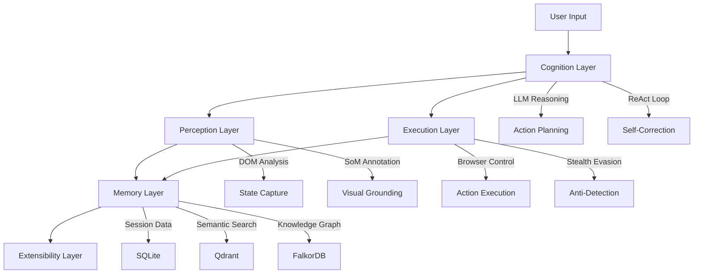

# AI-First Smart Browser

**Production-ready autonomous web agent with multi-modal perception and stealth capabilities**

---

## Overview

The AI-First Smart Browser is a sophisticated web automation framework that combines cutting-edge browser stealth techniques with advanced AI reasoning capabilities. Built for production environments, it provides a robust foundation for autonomous web interactions while maintaining undetectable operation.

## Key Features

### 🎯 **Autonomous Task Execution**
- Natural language task interpretation
- Multi-step workflow orchestration
- Self-correcting action loops with ReAct reasoning

### 🔍 **Multi-Modal Perception**
- DOM-based state capture and analysis
- Set-of-Marks (SoM) visual annotation system
- Screenshot-based element identification

### 🥷 **Military-Grade Stealth**
- Plugin-based evasion system
- Canvas fingerprinting protection
- WebDriver detection bypass
- User agent and header spoofing

### 🧠 **Advanced Memory System**
- SQLite session storage for short-term memory
- Qdrant vector database for semantic search
- FalkorDB knowledge graph for relationship mapping
- Intelligent caching and retrieval strategies

### 🔌 **Extensible Architecture**
- 5-layer separation of concerns
- Plugin system with hot reload
- MCP protocol support for external integrations
- Container-aware deployment

## Quick Start

### Installation

```bash
# Clone the repository
git clone https://github.com/your-org/ai-first-smart-browser.git
cd ai-first-smart-browser

# Create virtual environment
python -m venv venv
source venv/bin/activate  # On Windows: venv\Scripts\activate

# Install dependencies
pip install -r requirements.txt

# Install browser engines
playwright install chromium
```

### Basic Usage

```python
from src.main import SmartBrowser

# Initialize browser with stealth capabilities
browser = SmartBrowser(
    headless=True,
    stealth_mode=True
)

# Execute natural language task
result = await browser.execute_task(
    task="Search for Python tutorials and bookmark the top 3 results",
    url="https://google.com"
)

print(f"Task completed: {result.success}")
print(f"Actions taken: {len(result.actions)}")
```

### Configuration

Set up your environment variables:

```bash
# .env file
OPENAI_API_KEY=your_openai_key
ANTHROPIC_API_KEY=your_anthropic_key
GOOGLE_API_KEY=your_google_key

# Container services (optional)
QDRANT_HOST=localhost
QDRANT_PORT=6333
FALKORDB_HOST=localhost
FALKORDB_PORT=6379
```

## Architecture Overview



## Core Components

### 🎭 **Stealth System**

Advanced anti-detection techniques:

- **WebDriver Flag Removal**: Eliminates `navigator.webdriver` detection
- **Canvas Fingerprinting**: Adds subtle noise to prevent canvas tracking
- **Plugin Spoofing**: Emulates realistic browser plugin arrays
- **Header Consistency**: Maintains consistent user agent across requests

### 🔄 **ReAct Reasoning Loop**

Intelligent task execution with self-correction:

1. **Reason**: Analyze current state and plan next action
2. **Act**: Execute the planned browser action
3. **Observe**: Capture and analyze the resulting state
4. **Repeat**: Continue until task completion or error recovery

### 💾 **Multi-Tier Memory**

Sophisticated storage and retrieval system:

- **Session Memory**: Immediate task context and browser state
- **Semantic Memory**: Vector embeddings for similarity search
- **Knowledge Graph**: Relationship mapping between pages and actions

## Production Features

### 📊 **Monitoring & Observability**

- Comprehensive metrics collection
- Real-time health monitoring  
- Alert system with configurable thresholds
- Performance benchmarking and optimization

### 🔒 **Security Hardening**

- API key encryption and rotation
- Secure container deployment
- Privacy-compliant data handling
- Audit logging and compliance

### 🚀 **High Performance**

- Async/await throughout
- Connection pooling and reuse
- Intelligent caching strategies
- Resource optimization

## Use Cases

### 🛒 **E-commerce Automation**
- Price monitoring and comparison
- Automated purchasing workflows
- Inventory tracking and alerts

### 📊 **Data Collection**
- Web scraping at scale
- Research and lead generation
- Competitive intelligence

### 🧪 **Testing & QA**
- Automated user journey testing
- Cross-browser compatibility
- Performance regression testing

### 🔍 **Research & Analysis**
- Academic research automation
- Market analysis and reporting
- Content aggregation and curation

## Getting Help

- **Documentation**: Comprehensive guides and API reference
- **Examples**: Real-world usage patterns and code samples
- **Community**: GitHub Discussions for questions and sharing
- **Support**: Professional support available for enterprise users

## Contributing

We welcome contributions! See our [Contributing Guide](development/contributing.md) for:

- Code style and standards
- Testing requirements
- Pull request process
- Development environment setup

## License

This project is licensed under the MIT License. See [LICENSE](LICENSE) for details.

---

**Ready to get started?** Head over to our [Quick Start Guide](getting-started/quickstart.md) or explore the [Architecture Overview](architecture/overview.md) to understand how everything works together.