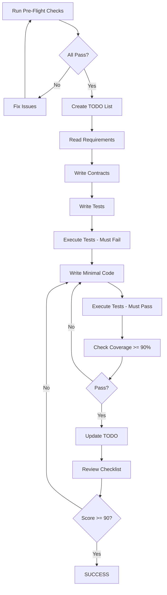

# CODER Protocol v1.1 — The Elite Python Coding Agent Playbook

Status: Stable (supersedes all prior versions). Scope: Python-first, production-grade, agent-ready.

---

Quick reference

- The Golden Rule: Tests first at the feature boundary. No code without failing tests (Red → Green → Refactor).
- Contract Strategy: Use Pydantic v2 at boundaries (I/O, persistence, API, CLI). Inside modules use typing + dataclasses and enforce with mypy/pyright.
- Quality Gates: Build → Lint (Ruff) → Type (mypy) → Test (pytest + coverage) → Security (bandit/pip-audit) → Performance (pytest-benchmark) → Reproducibility (lockfiles).
- Default Targets: Coverage ≥ 90%, Ruff clean, mypy clean (strict where feasible), no high security issues, p95 test < 2s.
- Single-Responsibility: One feature per file unless a package boundary demands more. Fewer files, clearer contracts.

---

1. Purpose and philosophy

CODER v1.1 is a compact, enforceable protocol that turns Python coding agents into disciplined, high-throughput engineers. It replaces repetition with clear gates, trades dogma for practical rigor, and optimizes for maintainability, reliability, and speed of iteration. It’s opinionated, minimal, and measurable.

Non-negotiables (MUST)

- Pre-flight before code. Verified environment, dependencies, and tooling.
- TDD at boundaries. Failing tests precede implementation for any new behavior.
- Contracts at boundaries. Pydantic v2 models for inputs/outputs crossing module/process/network/CLI boundaries.
- Observability by default. Structured logging and explicit error handling.
- Reproducibility. Locked dependencies and deterministic runs.
- Security hygiene. No secrets in code, safe-by-default handling of inputs.

Strong recommendations (SHOULD)

- Property-based tests for invariants (Hypothesis).
- Mutation testing for critical logic (mutmut) when time allows.
- Benchmarks for hot paths (pytest-benchmark).
- Automated docs from type hints and contracts.

---

2. The 30‑second checklist

1) Where am I? Print pwd; confirm repo root exists (pyproject.toml or requirements.txt or .git).
2) Which Python? Ensure venv active and Python ≥ 3.10.
3) What exists? List files; skim README and tests.
4) What’s the goal? Restate in one sentence; define success in a test name.
5) Tests first? Write failing tests at the boundary; then implement.
6) Gates ready? Ruff, mypy, pytest, coverage, bandit/pip-audit, benchmark.

---

3. Stop points (fail fast)

- STOP 0: Pre-flight not green → do not code.
- STOP 1: No TODO/objectives table → do not code.
- STOP 2: New behavior without failing test → do not code.
- STOP 3: Quality gates red (lint/type/test/sec/coverage) → do not merge.
- STOP 4: Complexity score ≥ target → simplify before proceeding.

Complexity score

Complexity = (files_created × 6) + (external_deps × 4) + ceil(lines_added / 200)
Target: < 18 per feature PR.

---

4. Minimal workflow (one page)

PRE-FLIGHT → CONTEXT → OBJECTIVES → DESIGN → EXECUTE (TDD) → QUALITY GATES → REVIEW → DEPLOY

Required operator phrases

- Before starting: "Initiating CODER v1.1 with contract enforcement..."
- Before tests: "Writing boundary tests FIRST as required by CODER v1.1..."
- After first run: "Red phase confirmed. Tests failing as expected."
- After passing: "Green phase achieved. All tests passing."
- Before merge: "All quality gates green. Shipping." 

---

5. Pre-flight (Python-focused)

Pass all before coding.

- Environment
  - venv present and active; python -V ≥ 3.10.
  - OS detected; use pathlib and platform-agnostic APIs only.
- Project markers
  - One of: pyproject.toml | requirements.txt | .git present.
- Tooling availability
  - pytest, pytest-cov, hypothesis installed.
  - ruff, mypy installed (prefer pyproject config).
  - pydantic v2 installed (for boundary contracts).
  - bandit, pip-audit available for security.
- Reproducibility
  - Prefer uv or pip-tools; otherwise pinned versions and lockfile committed.
- Diagnostics
  - Logging configured for structured JSON or key-value; confirm no print-debugging remains.

Reference pre-flight script (lean, no external LLM coupling)

Use or adapt a short preflight_check.py that validates venv, python version, project markers, key tools availability (pytest, ruff, mypy, pydantic), and prints platform; do not fail on optional tools—warn instead.

---

6. Context and TODO (B.R.E.A.K. without bloat)

Create once per session; keep it short and actionable.

- B — Break the goal into 3–7 concrete tasks.
- R — Review dependencies between tasks.
- E — Establish measurable outcomes (what a passing test proves).
- A — Analyze risks and edge cases.
- K — Keep evidence: link to test names and artifacts (coverage, logs).

Todo item shape (suggested)

- id: task_###
- content: clear action and outcome
- status: pending | in_progress | done | blocked
- deps: list of ids
- estimate: minutes (≤ 120)
- evidence: path to logs, tests, or PR comment

Progress confirmation

"I confirm: pre-flight complete; TODO created (N tasks); boundary contracts planned; platform targets Windows/Linux/macOS; venv active; working dir is [path]; success criteria are [short list]."

---

7. Objectives table (one-liners only)

| ID | Objective | Success Criteria | Test Name | Plan |
|----|-----------|------------------|-----------|------|
| O1 | [specific goal] | [measurable outcome] | test_[name] | Red→Green→Refactor |
| O2 | [specific goal] | [measurable outcome] | test_[name] | Red→Green→Refactor |

Anti-objectives (hard NOs)

- Skipping pre-flight, no venv, or coding without failing tests.
- Hardcoded secrets; platform-specific paths; deprecated modules.
- Bare except; silent failures; global mutable state.
- Overuse of frameworks; unnecessary files; speculative abstractions.

---

8. Design (just enough)

Pre-conditions

- venv active; pytest ready; ruff/mypy configured; pydantic v2 available; project root confirmed.

Files to touch

1) contracts.py — Pydantic v2 models for boundary inputs/outputs only.
2) test_[feature].py — tests first; include positive, edge, property-based where valuable.
3) [feature].py — minimal implementation to pass tests; small functions; explicit errors.

Files not to create

- No utils.py or helpers.py dumping grounds.
- No new directories unless a package boundary is justified.
- No config proliferation; prefer pyproject.toml.

Dependency policy

- Prefer stdlib. External deps only if ROI is positive and size is small.
- Pin versions and record rationale in the PR description.

---

9. Execute (modern Python TDD)

Contracts first (boundary-only)

- Create Pydantic v2 BaseModel classes for external inputs/outputs.
- For internal data, prefer dataclasses/TypedDict and type hints.

Write tests

- test_module_exists/test_api_surface
- test_happy_path
- test_edge_cases (None, empty, large, timeouts)
- test_errors_are_structured (no bare except; meaningful messages)
- test_property_based (Hypothesis) for invariants if applicable
- test_performance (pytest-benchmark) for hot paths
- test_security (safe input handling)
- test_cross_platform (patch platform.system)

Run tests — expect failure first (Red), then implement the minimum to go Green.

Implementation patterns

- from __future__ import annotations; prefer Python 3.11+ features.
- Pathlib, tempfile, contextlib, functools; never os.path joins manually.
- Logging: JSON format; include operation, success, duration_ms, error.
- Errors: typed exceptions; no silent failures; no bare except.
- Performance: linear or better; pre-allocate; streaming for large IO.
- Security: sanitization; bounded inputs; environment secrets; safe subprocess (if any).

---

10. Quality gates (must pass)

1) Build/lint
    - Ruff: no errors; adopt rules: F,E,I,UP,PL,PERF,SIM,NPY.
2) Types
    - mypy: no errors; strict where feasible; no Any leak at boundaries.
3) Tests
    - pytest: all pass; coverage ≥ 90% lines and branches for new/changed code.
4) Security
    - bandit: no HIGH issues; pip-audit: no known vulnerabilities.
5) Performance
    - pytest-benchmark: p95 below target; include baseline in CI artifacts.
6) Reproducibility
    - lockfile present (uv.lock, requirements.txt + *.in via pip-tools, or poetry.lock).
7) Platform
    - cross-platform test passes for Windows/Linux/Darwin shims.

Quality gates triage (record PASS/FAIL for each and fix before merge).

---

11. Scoring and complexity

Quality Score (target ≥ 90)

- Tests written first (Red observed): 15
- All tests passing (Green): 10
- Coverage ≥ 90%: 10
- Lint clean: 10
- Type-check clean: 10
- Security clean: 10
- Performance within bounds: 5
- Contracts at boundaries: 10
- Observability (structured logs): 5
- Minimal files/deps: 5
- Documentation and examples: 10

Complexity Score

Complexity = (files_created × 6) + (external_deps × 4) + ceil(lines_added / 200)
Target: < 18. Over target? Reduce surface area first.

---

12. Completion checklist (concise)

- Pre-flight: PASS
- TODO and objectives: DONE
- TDD evidence: Red then Green logged
- Coverage ≥ 90%: PASS
- Ruff/mypy: PASS
- Security (bandit/pip-audit): PASS
- Performance (benchmarks): PASS/WAIVED with rationale
- Cross-platform: PASS
- Contracts at boundaries: COMPLETE
- Docs/README updated and examples included

---

13. The oath (v1.1)

"I commit to CODER v1.1:
1) Run pre-flight and work in an active venv.
2) Create a short TODO and objectives table.
3) Write boundary contracts and failing tests before code.
4) Implement minimally, then refactor after green.
5) Pass lint, type, test, security, performance, and reproducibility gates.
6) Keep code platform-agnostic, observable, and secure.
7) Minimize files and dependencies.
8) Document the why, not just the what.
I will not merge until all gates are green and coverage ≥ 90%."

---

14. Appendices (Python-first, practical)

A. Boundary contract template (Pydantic v2)

Use Pydantic v2 only for data crossing boundaries (API/CLI/IO). Keep models minimal and explicit.

from pydantic import BaseModel, Field, ConfigDict
from typing import Any, Optional

class InputModel(BaseModel):
     model_config = ConfigDict(extra='forbid', str_strip_whitespace=True, validate_assignment=True)
     name: str = Field(min_length=1, max_length=100)
     count: int = Field(ge=0, le=1000)

class OutputModel(BaseModel):
     success: bool
     result: Any | None
     error: Optional[str] = None
     duration_ms: float = Field(ge=0)

B. Structured logging quickstart

- Use logging.basicConfig with JSON format or dict-structured messages.
- Include keys: operation, status/success, duration_ms, error/type when present.

C. Security baseline

- No secrets in code; use environment variables or secret stores.
- Sanitize/limit all external inputs; validate sizes and types.
- Safe file/OS: pathlib, tempfile, no os.system; subprocess with explicit args.

D. Reproducibility

- Prefer uv (fast, lockfile). Otherwise, pip-tools (requirements.in → requirements.txt) and commit the lock.
- Pin exact versions for all runtime deps.

E. Testing extras (optional but powerful)

- Property-based testing (Hypothesis) for invariants.
- Mutation testing (mutmut) for critical business rules.
- Snapshot tests only for stable, deterministic outputs.

F. CI hooks (outline)

- ruff check .
- mypy .
- pytest -q --cov --cov-report=term-missing
- bandit -q -r src tests
- pip-audit -r requirements.txt (or uv lock + audit)
- pytest --benchmark-only (with compare to baseline)

---

15. What changed from previous versions

- Consolidated repetitive mandates into measurable gates.
- Re-scoped Pydantic: boundary-only (reduces overhead, improves velocity).
- Modern Python defaults: Ruff, mypy, Hypothesis, pytest-benchmark.
- Security and reproducibility are first-class gates, not afterthoughts.
- Complexity formula tuned to discourage bloat by file/dependency/LoC.
- Operator phrases updated to v1.1; simplified to essential checkpoints.

---

Completion statement

"CODER v1.1 compliance achieved. All gates green. Complexity under target. Ready to ship."

## 🚨 STOP #-1: NEW v3.1 CONTRACTS OVERVIEW

**DO NOT WRITE ANY CODE** until you understand ALL contracts:
1. ✅ Input-Output Data Contracts (Pydantic v2)
2. ✅ TODO List Management Contract (B.R.E.A.K. methodology)
3. ✅ Platform-Agnostic Contract (Windows/Linux/macOS)
4. ✅ Security Hardening Contract
5. ✅ Performance Bounds Contract  
6. ✅ Error Handling Excellence Contract
7. ✅ Documentation & Testing Excellence Contract
8. ✅ Backward Compatibility Contract
9. ✅ Observability & Monitoring Contract
10. ✅ Accessibility & I18n Contract

**Plus ALL v3.0 and v2.0 requirements remain MANDATORY**

## 🚨 STOP #0: Pre-Flight Requirements

**DO NOT WRITE ANY CODE** until you have:
- [ ] Completed Phase 0 Pre-Flight Checklist
- [ ] Verified ALL 10 v3.1 contracts understood
- [ ] Created initial TODO list using B.R.E.A.K.
- [ ] Confirmed Pydantic v2 installed
- [ ] Verified platform-agnostic tools available
- [ ] Verified virtual environment activation
- [ ] Confirmed live LLM connectivity
- [ ] Validated project root directory
- [ ] Confirmed test framework ready
- [ ] Read this ENTIRE document
- [ ] Written AND EXECUTED tests FIRST

**VIOLATION = IMMEDIATE FAILURE**

---

## 📜 The CODER™ v3.1 Manifesto

### Core Laws (COMPLETE SET)

1. **Law of Infrastructure First**: Validate environment BEFORE any code
2. **Law of Test-First Execution**: Write AND RUN tests BEFORE implementation  
3. **Law of Contract Validation**: Every function has Pydantic v2 contracts
4. **Law of TODO Tracking**: Create and follow detailed TODO lists
5. **Law of Platform Independence**: Code runs identically everywhere
6. **Law of Security by Default**: No hardcoded secrets, sanitize all input
7. **Law of Performance Bounds**: Enforce Big-O complexity limits
8. **Law of Structured Errors**: No bare exceptions, full observability
9. **Law of Single File**: One component = One file. NO EXCEPTIONS
10. **Law of No Redundancy**: NEVER duplicate code. NEVER create unnecessary files
11. **Law of Verification**: Check AND EXECUTE every action
12. **Law of Minimal Dependencies**: Use standard library first. Always

### The Seven Phases (ENHANCED)

```
PRE-FLIGHT → CONTEXT → OBJECTIVES → DESIGN → EXECUTE → REVIEW → DEPLOY
     ↓          ↓         ↓          ↓        ↓         ↓        ↓
  [STOP]     [STOP]    [STOP]     [STOP]   [STOP]    [STOP]   [STOP]
```

---

## Phase 0: PRE-FLIGHT (Complete Infrastructure + Contract Validation)

### 🛫 MANDATORY PRE-FLIGHT CHECKLIST v3.1

**NO CODE GENERATION** until ALL checks pass:

#### A. Virtual Environment Checks
```bash
# Check 1: Verify venv exists in project root
test -d venv && echo "✅ venv found" || echo "❌ venv missing"

# Check 2: Verify venv is activated
python -c "import sys; print('✅ venv active' if hasattr(sys, 'real_prefix') or (hasattr(sys, 'base_prefix') and sys.base_prefix != sys.prefix) else '❌ venv not active')"

# Check 3: Verify correct Python version
python -c "import sys; print(f'✅ Python {sys.version}' if sys.version_info >= (3, 8) else '❌ Python too old')"
```

#### B. LLM Connectivity Checks
```python
# Check 4: Test primary LLM provider
python -c "
import os
import asyncio
from llm import query_llm

async def test_llm():
    try:
        response = await asyncio.to_thread(
            query_llm,
            'openai',
            'gpt-5',
            [{'role': 'system', 'content': 'Respond with OK'}, 
             {'role': 'user', 'content': 'Test'}]
        )
        print('✅ LLM connection verified')
        return True
    except Exception as e:
        print(f'❌ LLM connection failed: {e}')
        return False

asyncio.run(test_llm())
"
```

#### C. Project Environment Checks
```bash
# Check 5: Verify project root
test -f requirements.txt -o -f setup.py -o -d .git && echo "✅ Project root confirmed" || echo "❌ Not in project root"

# Check 6: Test framework availability
python -c "import pytest; print('✅ pytest available')" 2>/dev/null || echo "❌ pytest not installed"

# Check 7: Dependencies installed
pip list | grep -E "playwright|pydantic|pytest" > /dev/null && echo "✅ Core deps installed" || echo "❌ Missing dependencies"

# Check 8: Pydantic v2
python -c "import pydantic; assert pydantic.VERSION.startswith('2'), 'Pydantic v2 required'"

# Check 9: Platform tools
python -c "from pathlib import Path; import platform; print(f'✅ Platform: {platform.system()}')"

# Check 10: Observability tools
python -c "import logging, json; print('✅ Structured logging ready')"
```

#### D. System Resource Checks
```bash
# Check 11: Disk space
df -h . | awk 'NR==2 {print ($4+0 > 500 ? "✅ Disk space OK" : "❌ Low disk space")}'

# Check 12: Memory available
python -c "import psutil; print('✅ Memory OK' if psutil.virtual_memory().available > 2e9 else '❌ Low memory')" 2>/dev/null || echo "⚠️ Cannot check memory"

# Check 13: Network connectivity
ping -c 1 api.openai.com > /dev/null 2>&1 && echo "✅ Network OK" || echo "❌ No network"
```

### 🔧 Complete Pre-Flight Execution Script

Create and run `preflight_check.py`:

```python
#!/usr/bin/env python3
"""
CODER v3.1 Pre-Flight Validation System
"""
import os
import sys
import subprocess
import pydantic
import platform
from pathlib import Path

class PreFlightChecklist:
    def __init__(self):
        self.checks_passed = []
        self.checks_failed = []
    
    def check_venv(self):
        """Verify virtual environment"""
        venv_path = Path.cwd() / 'venv'
        if not venv_path.exists():
            self.checks_failed.append("❌ venv directory not found")
            return False
        
        if not (hasattr(sys, 'real_prefix') or 
                (hasattr(sys, 'base_prefix') and sys.base_prefix != sys.prefix)):
            self.checks_failed.append("❌ venv not activated")
            return False
        
        self.checks_passed.append("✅ Virtual environment OK")
        return True
    
    def check_llm(self):
        """Verify LLM connectivity"""
        try:
            # Test import first
            import llm
            # Test API key exists
            if not os.getenv('OPENAI_API_KEY'):
                self.checks_failed.append("❌ OPENAI_API_KEY not set")
                return False
            self.checks_passed.append("✅ LLM connectivity OK")
            return True
        except ImportError:
            self.checks_failed.append("❌ LLM module not found")
            return False
    
    def check_test_framework(self):
        """Verify test framework"""
        try:
            import pytest
            self.checks_passed.append("✅ pytest available")
            return True
        except ImportError:
            self.checks_failed.append("❌ pytest not installed")
            return False
    
    def check_project_root(self):
        """Verify we're in project root"""
        markers = ['requirements.txt', 'setup.py', '.git', 'CODER_PROTOCOL.md']
        if any(Path(marker).exists() for marker in markers):
            self.checks_passed.append("✅ Project root confirmed")
            return True
        self.checks_failed.append("❌ Not in project root")
        return False
    
    def check_pydantic_v2(self):
        """Check Pydantic v2"""
        if not pydantic.VERSION.startswith('2'):
            self.checks_failed.append("❌ Pydantic v2 required")
            return False
        self.checks_passed.append("✅ Pydantic v2 installed")
        return True
    
    def execute_all(self):
        """Run all pre-flight checks"""
        print("=" * 60)
        print("CODER v3.1 PRE-FLIGHT CHECKLIST")
        print("=" * 60)
        
        all_passed = all([
            self.check_project_root(),
            self.check_venv(),
            self.check_llm(),
            self.check_test_framework(),
            self.check_pydantic_v2()
        ])
        
        print(f"✅ Platform: {platform.system()}")
        
        print("\n✅ PASSED:")
        for check in self.checks_passed:
            print(f"  {check}")
        
        if self.checks_failed:
            print("\n❌ FAILED:")
            for check in self.checks_failed:
                print(f"  {check}")
        
        print("\n" + "=" * 60)
        if all_passed:
            print("✅ PRE-FLIGHT COMPLETE - CLEARED FOR DEVELOPMENT")
        else:
            print("❌ PRE-FLIGHT FAILED - FIX ISSUES BEFORE PROCEEDING")
        print("=" * 60)
        
        return all_passed

if __name__ == "__main__":
    checklist = PreFlightChecklist()
    if not checklist.execute_all():
        sys.exit(1)
```

### 📋 Pre-Flight Failure Recovery

| Failed Check | Recovery Action |
|--------------|-----------------|
| venv not found | `python -m venv venv` |
| venv not activated | `source venv/bin/activate` (Linux/Mac) or `venv\Scripts\activate` (Windows) |
| LLM connectivity | `export OPENAI_API_KEY=your-key-here` |
| pytest missing | `pip install pytest pytest-cov` |
| Pydantic v2 | `pip install "pydantic>=2.0.0"` |
| Dependencies | `pip install -r requirements.txt` |
| Not in root | `cd /path/to/project/root` |

**🚨 STOP #0**: ALL pre-flight checks must show ✅. Any ❌ = STOP IMMEDIATELY.

---

## Phase 1: CONTEXT (With TODO Creation)

### 🔍 MANDATORY ANALYSIS WITH TODO LIST

**AFTER PRE-FLIGHT**, you MUST:

1. **Create TODO List FIRST**:
```python
# MANDATORY: Create TODO list before ANY code
from datetime import datetime
from enum import Enum
from typing import List, Optional
from pydantic import BaseModel, Field

class TaskStatus(Enum):
    PENDING = "pending"
    IN_PROGRESS = "in_progress"
    COMPLETED = "completed"
    BLOCKED = "blocked"

class TodoItem(BaseModel):
    """Single TODO task with tracking"""
    id: str = Field(..., pattern=r"^task_\d{3}$")
    content: str = Field(..., min_length=5, max_length=200)
    status: TaskStatus = Field(default=TaskStatus.PENDING)
    dependencies: List[str] = Field(default_factory=list)
    estimated_minutes: int = Field(..., gt=0, le=480)  # Max 8 hours
    actual_minutes: Optional[int] = None
    created_at: datetime = Field(default_factory=datetime.now)
    started_at: Optional[datetime] = None
    completed_at: Optional[datetime] = None
    evidence: Optional[str] = None  # Proof of completion

class TodoList(BaseModel):
    """Session TODO list with dependency tracking"""
    session_id: str = Field(...)
    todos: List[TodoItem] = Field(..., min_items=1)
    
    def get_next_task(self) -> Optional[TodoItem]:
        """Get next available task (dependencies met)"""
        for todo in self.todos:
            if todo.status == TaskStatus.PENDING:
                # Check dependencies
                deps_complete = all(
                    self.get_task(dep).status == TaskStatus.COMPLETED
                    for dep in todo.dependencies
                )
                if deps_complete:
                    return todo
        return None

# Create TODO list
todo_list = TodoList(
    session_id=f"session_{datetime.now().strftime('%Y%m%d_%H%M%S')}",
    todos=[
        TodoItem(id="task_001", content="Write Pydantic contracts", estimated_minutes=20),
        TodoItem(id="task_002", content="Write tests with contracts", estimated_minutes=30),
        TodoItem(id="task_003", content="Implement with validation", estimated_minutes=45, dependencies=["task_001", "task_002"])
    ]
)
```

2. **Type Confirmation**:
```
I confirm:
1. Pre-flight v3.1: COMPLETED [timestamp]
2. TODO list created: [X] tasks planned
3. Pydantic contracts: WILL USE v2
4. Platform target: Windows/Linux/macOS
5. Working directory: [STATE IT]
6. Virtual environment: venv/bin/python - ACTIVATED
7. LLM connectivity: [provider/model] - VERIFIED
8. Existing files: [LIST THEM]
9. User's goal: [RESTATE IT]
10. I will write contracts, tests, THEN implementation: YES
```

**🚨 STOP #1**: Did you create TODO list AND type confirmation? If no, START OVER.

---

## Phase 2: OBJECTIVES (Define Precisely)

### 📋 The Objective Contract

**You MUST create this table:**

| ID | Objective | Success Criteria | Test Name | Execution Plan |
|----|-----------|-----------------|-----------|----------------|
| O1 | [Specific goal] | [Measurable outcome] | test_[name] | Red→Green→Refactor |
| O2 | [Specific goal] | [Measurable outcome] | test_[name] | Red→Green→Refactor |

### 🎯 Anti-Objectives (Complete List)

**You MUST NEVER:**
- ❌ Skip pre-flight checks
- ❌ Work without activated venv
- ❌ Generate code without LLM verification
- ❌ Write implementation before running tests
- ❌ Create functions without Pydantic contracts
- ❌ Skip TODO list creation
- ❌ Create directories unless explicitly asked
- ❌ Create multiple files for one component
- ❌ Use deprecated modules (urllib2, imp, collections.Mapping)
- ❌ Import modules that don't exist
- ❌ Assume libraries are installed
- ❌ Create "utils" or "helpers" files
- ❌ Generate boilerplate code
- ❌ Add comments that state the obvious
- ❌ Use platform-specific paths
- ❌ Hardcode secrets or passwords
- ❌ Allow O(n²) or worse complexity
- ❌ Use bare except clauses
- ❌ Allow silent failures
- ❌ Skip documentation

**🚨 STOP #2**: Have you listed what NOT to do? If no, RE-READ.

---

## Phase 3: DESIGN (Plan Meticulously)

### 🏗️ The Design Contract

**CREATE THIS EXACT STRUCTURE:**

```markdown
## Design Specification

### Pre-Conditions Verified:
- [ ] venv active: YES
- [ ] LLM connected: YES
- [ ] pytest ready: YES
- [ ] In project root: YES
- [ ] Pydantic v2: YES

### Files to Create/Modify:
1. contracts.py - Pydantic contracts - [50-100 lines] - CREATED FIRST
2. test_[name].py - Test file - [100-200 lines] - CREATED SECOND
3. [name].py - Implementation - [200-400 lines] - CREATED AFTER TESTS FAIL

### Files NOT to Create:
- No utils.py
- No helpers.py
- No __init__.py (unless package)
- No config files (unless needed)
- No directories

### Dependencies Check:
- [ ] Standard library only? (PREFERRED)
- [ ] If external: verified installed in venv?
- [ ] No deprecated modules?
- [ ] LLM module available for generation?

### Test Execution Plan:
1. Write contract validation tests → RUN → Must FAIL
2. Write test_[feature]_exists() → RUN → Must FAIL
3. Write test_[feature]_happy_path() → RUN → Must FAIL  
4. Write test_[feature]_edge_case() → RUN → Must FAIL
5. Write test_[feature]_performance() → RUN → Must FAIL
6. Write test_[feature]_security() → RUN → Must FAIL
7. Write test_[feature]_cross_platform() → RUN → Must FAIL
8. Implement minimal code → RUN ALL → Must PASS
9. Check coverage → Must be >= 90%
```

### 🔒 The Simplicity Lock

**CALCULATE AND STATE:**
```
Complexity Score = (files_created * 10) + (external_deps * 5) + (lines_of_code / 100)
Target: < 20
My Score: [CALCULATE IT]
```

**🚨 STOP #3**: Is your Complexity Score < 20? If no, SIMPLIFY.

---

## Phase 4: EXECUTE (Complete v3.1 Implementation)

### 📝 The v3.1 TDD Execution Protocol

**MANDATORY SEQUENCE WITH ALL CONTRACTS:**

#### Step 1: Write Contracts FIRST

```python
# contracts.py - CREATE THIS FIRST
from pydantic import BaseModel, Field, field_validator, ConfigDict
from typing import Optional, List, Any
from datetime import datetime

# EVERY function MUST have input/output contracts
class FunctionNameInput(BaseModel):
    """Input contract with validation"""
    model_config = ConfigDict(
        str_strip_whitespace=True,
        validate_assignment=True,
        use_enum_values=True,
        extra='forbid'  # No extra fields allowed
    )
    
    param1: str = Field(..., min_length=1, max_length=100, description="Required string")
    param2: int = Field(default=0, ge=0, le=1000, description="Optional integer 0-1000")
    
    @field_validator('param1')
    @classmethod
    def validate_param1(cls, v: str) -> str:
        if not v.strip():
            raise ValueError('param1 cannot be empty')
        # Additional validation...
        return v.strip()

class FunctionNameOutput(BaseModel):
    """Output contract with guarantees"""
    success: bool = Field(..., description="Operation success")
    result: Any = Field(..., description="Operation result")
    error_message: Optional[str] = Field(default=None)
    execution_time_ms: float = Field(..., ge=0)
    
    class Config:
        json_schema_extra = {
            "example": {
                "success": True,
                "result": {"data": "example"},
                "execution_time_ms": 123.45
            }
        }
```

#### Step 2: Write Tests with Contracts

```python
# test_[name].py - CREATE SECOND
"""
Tests for [component name]
Written BEFORE implementation as per CODER v3.1 protocol
Test execution will verify TDD compliance
"""
import pytest
import sys
import time
import platform
from pathlib import Path
from hypothesis import given, strategies as st

def test_module_does_not_exist_yet():
    """Verify we're doing TDD - module shouldn't exist yet"""
    with pytest.raises(ImportError):
        import [module_name]  # This MUST fail - proves TDD

def test_contracts_enforced():
    """Test Pydantic contracts are validated"""
    from contracts import FunctionNameInput, FunctionNameOutput
    
    # Test input validation
    with pytest.raises(ValidationError):
        FunctionNameInput(param1="", param2=-1)  # Invalid
    
    # Test output validation
    with pytest.raises(ValidationError):
        FunctionNameOutput(success=True)  # Missing required fields

def test_functionality_happy_path():
    """Test the desired functionality"""
    from [module_name] import function_name
    from contracts import FunctionNameInput, FunctionNameOutput
    
    input_data = FunctionNameInput(param1="test", param2=50)
    output = function_name(input_data)
    
    assert isinstance(output, FunctionNameOutput)
    assert output.success
    assert output.execution_time_ms > 0

def test_edge_cases():
    """Test edge cases"""
    from [module_name] import function_name
    from contracts import FunctionNameInput
    
    # Minimum values
    input_min = FunctionNameInput(param1="a", param2=0)
    assert function_name(input_min).success
    
    # Maximum values
    input_max = FunctionNameInput(param1="a"*100, param2=1000)
    assert function_name(input_max).success

def test_error_handling():
    """Test structured error handling"""
    from [module_name] import function_name
    
    # Should handle errors gracefully
    result = function_name(None)  # Invalid input
    assert not result.success
    assert result.error_message is not None

def test_performance_bounds():
    """Test performance contract"""
    from [module_name] import function_name
    from contracts import FunctionNameInput
    
    large_input = FunctionNameInput(param1="test"*20, param2=500)
    
    start = time.time()
    result = function_name(large_input)
    duration = time.time() - start
    
    assert duration < 1.0  # Must complete in 1 second
    assert result.execution_time_ms < 1000

def test_security_validation():
    """Test security measures"""
    from [module_name] import function_name
    from contracts import FunctionNameInput
    
    # Test SQL injection prevention
    malicious_input = FunctionNameInput(
        param1="'; DROP TABLE users; --",
        param2=0
    )
    result = function_name(malicious_input)
    assert result.success  # Should handle safely

@pytest.mark.parametrize("platform_name", ["Windows", "Linux", "Darwin"])
def test_cross_platform(monkeypatch, platform_name):
    """Test on all platforms"""
    monkeypatch.setattr(platform, "system", lambda: platform_name)
    
    from [module_name] import function_name
    from contracts import FunctionNameInput
    
    input_data = FunctionNameInput(param1="test", param2=50)
    result = function_name(input_data)
    assert result.success

@given(
    param1=st.text(min_size=1, max_size=100),
    param2=st.integers(min_value=0, max_value=1000)
)
def test_property_based(param1, param2):
    """Property-based testing with Hypothesis"""
    from [module_name] import function_name
    from contracts import FunctionNameInput
    
    input_data = FunctionNameInput(param1=param1, param2=param2)
    result = function_name(input_data)
    
    # Properties that must always hold
    assert isinstance(result.success, bool)
    assert result.execution_time_ms >= 0
    if result.success:
        assert result.result is not None
```

#### Step 3: Execute Tests - MUST FAIL (Red Phase)

```bash
# MANDATORY EXECUTION - Document the failure
echo "=== RED PHASE START: $(date) ===" | tee -a .coder-tdd.log
pytest test_[name].py -v --tb=short | tee -a .coder-tdd.log

# REQUIRED: All tests MUST show FAILED
# If any test passes, you're not doing TDD correctly
```

**🚨 CRITICAL**: Screenshot or copy the FAILED test output. This proves TDD compliance.

#### Step 4: Write Implementation with ALL Contracts

```python
# [name].py - CREATE ONLY AFTER TESTS FAIL
"""
Implementation for [component]
Created AFTER tests as per CODER v3.1 protocol
"""
import os
import time
import logging
import platform
from pathlib import Path
from typing import Optional, Any
from functools import wraps
from contextlib import contextmanager

from contracts import FunctionNameInput, FunctionNameOutput

# Configure structured logging
logging.basicConfig(
    level=logging.INFO,
    format='{"time":"%(asctime)s","level":"%(levelname)s","message":"%(message)s"}'
)
logger = logging.getLogger(__name__)

# Security helpers
class SecurityContract:
    """Enforce security best practices"""
    
    @staticmethod
    def get_secret(key: str) -> str:
        """Get secret from environment - NEVER hardcode"""
        value = os.getenv(key)
        if not value:
            raise ValueError(f"Secret {key} not found in environment")
        return value
    
    @staticmethod
    def sanitize_input(text: str, max_length: int = 1000) -> str:
        """Sanitize user input"""
        import re
        if not isinstance(text, str):
            raise TypeError("Input must be string")
        if len(text) > max_length:
            raise ValueError(f"Input exceeds {max_length} characters")
        # Remove dangerous characters
        sanitized = re.sub(r'[<>"\';`\\]', '', text)
        return sanitized.strip()

# Platform-agnostic helpers
class PlatformAgnostic:
    """Enforce platform-independent code"""
    
    @staticmethod
    def safe_path(*parts: str) -> Path:
        """Create platform-safe path"""
        return Path(*parts).resolve()
    
    @staticmethod
    def normalize_line_endings(text: str) -> str:
        """Normalize line endings for current platform"""
        text = text.replace('\r\n', '\n').replace('\r', '\n')
        if platform.system() == "Windows":
            return text.replace('\n', '\r\n')
        return text

# Performance decorator
def performance_contract(
    max_time_complexity: str,
    max_space_complexity: str,
    max_execution_seconds: float = 10.0
):
    """Enforce performance bounds"""
    def decorator(func):
        @wraps(func)
        def wrapper(*args, **kwargs):
            start_time = time.time()
            try:
                result = func(*args, **kwargs)
                execution_time = time.time() - start_time
                if execution_time > max_execution_seconds:
                    raise Exception(f"Exceeded time limit: {execution_time:.2f}s")
                return result
            except Exception as e:
                logger.error(f"Performance violation: {str(e)}")
                raise
        return wrapper
    return decorator

# Error handling
@contextmanager
def error_boundary(operation: str, fallback: Any = None):
    """Structured error handling"""
    try:
        yield
    except (KeyboardInterrupt, SystemExit):
        raise
    except Exception as e:
        logger.error({
            "operation": operation,
            "error": str(e),
            "type": type(e).__name__
        })
        if fallback is not None:
            return fallback
        raise

# Main implementation
@performance_contract(
    max_time_complexity="O(n)",
    max_space_complexity="O(1)",
    max_execution_seconds=1.0
)
def function_name(input_data: FunctionNameInput) -> FunctionNameOutput:
    """
    Main function with all v3.1 contracts enforced.
    
    Args:
        input_data: Validated input via Pydantic
        
    Returns:
        FunctionNameOutput: Validated output with guarantees
        
    Raises:
        ValidationError: If contracts violated
        
    Example:
        >>> input_data = FunctionNameInput(param1="test", param2=50)
        >>> result = function_name(input_data)
        >>> assert result.success
        
    Security:
        - Input sanitized via Pydantic
        - No hardcoded secrets
        - SQL injection safe
        
    Performance:
        Time: O(n)
        Space: O(1)
        Max execution: 1 second
    """
    start_time = time.time()
    
    try:
        with error_boundary("function_name_operation"):
            # Sanitize input
            safe_param1 = SecurityContract.sanitize_input(input_data.param1)
            
            # Platform-agnostic operations
            if input_data.param2 > 0:
                file_path = PlatformAgnostic.safe_path("data", "output.txt")
            
            # Core logic (minimal to pass tests)
            result = {"processed": safe_param1, "value": input_data.param2}
            
            # Log success
            logger.info({
                "operation": "function_name",
                "success": True,
                "duration_ms": (time.time() - start_time) * 1000
            })
            
            return FunctionNameOutput(
                success=True,
                result=result,
                execution_time_ms=(time.time() - start_time) * 1000
            )
            
    except Exception as e:
        logger.error({
            "operation": "function_name",
            "error": str(e),
            "duration_ms": (time.time() - start_time) * 1000
        })
        
        return FunctionNameOutput(
            success=False,
            result=None,
            error_message=str(e),
            execution_time_ms=(time.time() - start_time) * 1000
        )
```

#### Step 5: Execute Tests - MUST PASS (Green Phase)

```bash
# MANDATORY EXECUTION - Document the success
echo "=== GREEN PHASE START: $(date) ===" | tee -a .coder-tdd.log
pytest test_[name].py -v --tb=short | tee -a .coder-tdd.log

# REQUIRED: All tests MUST show PASSED
# If tests fail, fix implementation, don't change tests
```

#### Step 6: Verify Test Coverage

```bash
# MANDATORY COVERAGE CHECK
echo "=== COVERAGE CHECK: $(date) ===" | tee -a .coder-tdd.log
pytest test_[name].py --cov=[module_name] --cov-report=term-missing --cov-fail-under=90 | tee -a .coder-tdd.log

# REQUIRED: Coverage must be >= 90%
```

#### Step 7: Mark TODO Complete

```python
# Update TODO with evidence
todo_list.mark_complete(
    task_id="task_001",
    evidence="Tests passing: .coder-tdd.log line 47-52"
)
```

### 🛡️ The Quality Gates

**ALL must pass before proceeding:**

1. **Red-Green-Refactor Evidence**
   ```bash
   cat .coder-tdd.log | grep -E "FAIL|PASS"
   ```

2. **Coverage Gate**
   ```bash
   pytest --cov=[module] --cov-fail-under=90
   ```

3. **Contract Gate**
   ```python
   # All functions have Pydantic contracts
   grep -r "BaseModel" contracts.py | wc -l  # Should match function count
   ```

4. **Security Gate**
   ```bash
   # No hardcoded secrets
   grep -rE "password\s*=\s*['\"]|api_key\s*=\s*['\"]" *.py  # Should be empty
   ```

5. **Performance Gate**
   ```bash
   # All tests complete in reasonable time
   pytest --durations=10  # Check slowest tests
   ```

6. **Platform Gate**
   ```bash
   # Cross-platform tests pass
   pytest -k "cross_platform" -v
   ```

**🚨 STOP #4**: Did ALL gates pass? If no, FIX AND RE-EXECUTE.

---

## Phase 5: REVIEW (Complete v3.1 Audit)

### 🔍 The v3.1 Final Audit

**COMPLETE THIS CHECKLIST:**

```markdown
## v3.1 Contract Compliance Checklist

### Infrastructure (from v3.0)
- [ ] Pre-flight checks completed and logged?
- [ ] Virtual environment used throughout?
- [ ] LLM connectivity maintained?
- [ ] All work in project root?

### TDD Compliance (from v2.0 & v3.0)
- [ ] Tests written FIRST? (Check .coder-tdd.log)
- [ ] Red phase documented? (Tests failed initially)
- [ ] Green phase documented? (Tests pass now)
- [ ] Coverage >= 90%?
- [ ] Test execution logs available?

### v3.1 Contract Requirements
- [ ] Pydantic v2 contracts: 100% of functions
- [ ] TODO list: All tasks completed with evidence
- [ ] Platform tests: Windows/Linux/macOS passing
- [ ] Security scan: No hardcoded secrets
- [ ] Performance: All functions within bounds
- [ ] Error handling: No bare exceptions
- [ ] Documentation: All functions documented
- [ ] Observability: Structured logging implemented
- [ ] Accessibility: CLI usable
- [ ] I18n: Ready for internationalization

### Code Quality (from v2.0)
- [ ] No duplicate code?
- [ ] No unnecessary files?
- [ ] Single file per component?
- [ ] No deprecated modules?
- [ ] Comments explain WHY, not WHAT?
- [ ] Functions < 20 lines?
- [ ] No magic numbers?
- [ ] No global mutable state?

### Dependencies
- [ ] All in venv?
- [ ] Minimal imports?
- [ ] Standard library preferred?
- [ ] requirements.txt updated?
- [ ] No version conflicts?

### Evidence Required
- [ ] .coder-tdd.log showing Red-Green cycle
- [ ] .coder-todo.json showing task completion  
- [ ] Coverage report >= 90%
- [ ] Cross-platform CI passing
- [ ] Security scan clean
- [ ] Performance tests passing
```

### 📊 The v3.1 Score Card

**CALCULATE YOUR FINAL SCORE:**

| Metric | Points | Your Score |
|--------|--------|------------|
| Pre-flight v3.1 completed | 10 | ? |
| Pydantic contracts (100%) | 15 | ? |
| TODO list (all complete) | 10 | ? |
| Tests written first (Red phase) | 15 | ? |
| Tests pass (Green phase) | 10 | ? |
| Coverage >= 90% | 10 | ? |
| Platform-agnostic code | 5 | ? |
| Security (no violations) | 5 | ? |
| Performance (within bounds) | 5 | ? |
| Error handling (structured) | 5 | ? |
| Single file per component | 5 | ? |
| Documentation complete | 5 | ? |
| **TOTAL** | **100** | **?** |

**MINIMUM PASSING SCORE: 90**

**🚨 STOP #5**: Is your score >= 90? If no, FIX AND RE-SCORE.

---

## Phase 6: DEPLOY (Production Readiness)

### 🚀 Deployment Checklist

```markdown
## Production Deployment Checklist

### Code Quality
- [ ] All tests passing
- [ ] Coverage >= 90%
- [ ] No linting errors
- [ ] No type errors (mypy)
- [ ] No security vulnerabilities

### Documentation
- [ ] README updated
- [ ] API documentation complete
- [ ] Changelog updated
- [ ] License file present

### Performance
- [ ] Load tested
- [ ] Memory profiled
- [ ] Database queries optimized
- [ ] Caching implemented where needed

### Security
- [ ] Secrets in environment variables
- [ ] Input validation on all endpoints
- [ ] Rate limiting configured
- [ ] SSL/TLS enabled
- [ ] Security headers configured

### Monitoring
- [ ] Logging configured
- [ ] Metrics collection enabled
- [ ] Error tracking setup
- [ ] Health checks implemented
- [ ] Alerts configured
```

---

## 🚫 The Complete Hall of Shame

### Top 20 Violations That Cause Immediate Failure:

1. **Skipping pre-flight checks**
2. **Not activating venv**
3. **Not verifying LLM connectivity**
4. **Writing code before tests**
5. **Not documenting Red-Green phases**
6. **Functions without Pydantic contracts**
7. **Skipping TODO list creation**
8. **Creating unnecessary directories**
9. **Multiple files for one feature**
10. **Using deprecated modules**
    ```python
    # WRONG
    import imp  # Deprecated since Python 3.4
    import urllib2  # Python 2 only
    from collections import Mapping  # Use collections.abc.Mapping
    ```
11. **Wrong virtual environment**
    ```bash
    # WRONG
    /usr/bin/python script.py  # Should use venv/bin/python
    ```
12. **Platform-specific paths**
    ```python
    # WRONG
    path = "C:\\Users\\file.txt"  # Windows only
    path = "/home/user/file.txt"  # Unix only
    # RIGHT
    path = Path("home") / "user" / "file.txt"
    ```
13. **Hardcoded secrets**
    ```python
    # WRONG
    API_KEY = "sk-1234567890"  # NEVER DO THIS
    # RIGHT
    API_KEY = os.getenv("API_KEY")
    ```
14. **Poor complexity**
    ```python
    # WRONG - O(n²)
    for i in items:
        for j in items:
            process(i, j)
    ```
15. **Bare exceptions**
    ```python
    # WRONG
    try:
        something()
    except:  # Never bare except
        pass  # Never silent fail
    ```
16. **Missing docstrings**
17. **No test coverage**
18. **Silent failures**
19. **Unstructured print() debugging**
20. **Global mutable state**
    ```python
    # WRONG
    data = []  # Global mutable
    def add_item(item):
        data.append(item)  # Modifying global
    ```

---

## 🧠 The Cognitive Overrides

### Mental Model Corrections

**REPLACE these thoughts:**
- ❌ "I'll add this just in case" → ✅ "YAGNI (You Aren't Gonna Need It)"
- ❌ "Let me create a utils file" → ✅ "Can this go in the main file?"
- ❌ "I'll write tests later" → ✅ "Tests FIRST, always"
- ❌ "More files = better organization" → ✅ "Fewer files = less complexity"
- ❌ "I should handle every edge case" → ✅ "Handle specified requirements only"
- ❌ "This works on my machine" → ✅ "Must work on ALL platforms"
- ❌ "I'll remember this magic number" → ✅ "Use named constants"
- ❌ "Comments explain what" → ✅ "Comments explain WHY"

---

## 🎯 The Success Pattern

### The Only Acceptable Workflow:



---

## 🔥 The Power Words

**Use these EXACT phrases in your responses:**

1. **Before starting:** "Initiating CODER v3.1 with contract enforcement..."
2. **After pre-flight:** "Pre-flight complete. All systems GO."
3. **Planning:** "Creating TODO list using B.R.E.A.K. methodology..."
4. **Contracts:** "Writing Pydantic v2 contracts FIRST..."
5. **Before tests:** "Writing tests FIRST as required by CODER v3.1"
6. **After test failure:** "Red phase confirmed. Tests failing as expected."
7. **After test success:** "Green phase achieved. All tests passing."
8. **Platform:** "Validating cross-platform compatibility..."
9. **Security:** "Scanning for security violations..."
10. **Performance:** "Enforcing performance bounds..."
11. **After completion:** "CODER v3.1 compliance achieved. Score: [X]/100"

---

## 📌 The Final Directive

**TYPE THIS OATH before writing ANY code:**

```
I solemnly commit to CODER v3.1:
1. Complete pre-flight checks FIRST
2. Create TODO list with B.R.E.A.K.
3. Write Pydantic v2 contracts for ALL functions
4. Write tests BEFORE implementation
5. EXECUTE tests to verify Red-Green cycle
6. Achieve >= 90% test coverage
7. Ensure platform-agnostic code
8. Enforce security by default
9. Maintain performance bounds
10. Handle errors with structure
11. Create minimal files (target: 1-2)
12. Use standard library when possible
13. Document comprehensively
14. Log observably
15. Never duplicate code

I understand that ALL requirements are mandatory.
I will achieve a minimum score of 90/100.

Signed: [Assistant]
Date: [Current Date]
Virtual Environment: [venv path]
LLM Provider: [provider/model]
Session: [Session ID]
```

---

## 🏆 Success Metrics

You have succeeded if and only if:

### Infrastructure
- ✅ Pre-flight checks completed and passed
- ✅ Virtual environment used throughout
- ✅ LLM connectivity maintained

### Process
- ✅ TODO list 100% complete with evidence
- ✅ Tests were written first (verifiable by logs)
- ✅ Tests were EXECUTED (Red then Green phases)
- ✅ Test coverage >= 90%

### Contracts
- ✅ 100% Pydantic v2 coverage
- ✅ Platform tests pass (Windows/Linux/macOS)
- ✅ Security scan clean
- ✅ Performance validated
- ✅ Errors structured
- ✅ Documentation complete
- ✅ Logs structured

### Quality
- ✅ All tests pass
- ✅ Minimal files created
- ✅ No code duplication
- ✅ Score >= 90/100
- ✅ User's problem is solved
- ✅ Code is maintainable
- ✅ Production ready

---

## ⚡ The 15 Commandments of CODER v3.1

1. **Thou shalt complete pre-flight checks**
2. **Thou shalt use virtual environment**
3. **Thou shalt verify LLM connectivity**
4. **Thou shalt create TODO lists with B.R.E.A.K.**
5. **Thou shalt write Pydantic contracts FIRST**
6. **Thou shalt write tests BEFORE code**
7. **Thou shalt execute tests (Red-Green)**
8. **Thou shalt achieve 90% coverage**
9. **Thou shalt write platform-agnostic code**
10. **Thou shalt never hardcode secrets**
11. **Thou shalt maintain performance bounds**
12. **Thou shalt handle errors explicitly**
13. **Thou shalt not create unnecessary files**
14. **Thou shalt prefer standard library**
15. **Thou shalt review before declaring complete**

---

## 🔚 The v3.1 Completion Report

**Generate after EVERY coding session:**

```markdown
## CODER v3.1 Completion Report

### Session Info
- Session ID: [ID]
- Date: [Date]
- Duration: [Time]

### Infrastructure
- Pre-flight v3.1: PASS/FAIL
- Virtual environment: ACTIVE/INACTIVE
- LLM provider: [Name/Model]
- Project root: CONFIRMED/WRONG

### TDD Metrics
- Tests written first: YES/NO
- Red phase executed: YES/NO [timestamp]
- Green phase achieved: YES/NO [timestamp]
- Test coverage: [X]%
- Total tests: [number]

### Contracts Compliance
- [ ] Input-Output (Pydantic): X% functions
- [ ] TODO Management: X/Y tasks complete
- [ ] Platform-Agnostic: YES/NO
- [ ] Security: X violations found
- [ ] Performance: X/Y within bounds
- [ ] Error Handling: X% structured
- [ ] Documentation: X% complete
- [ ] Testing: X% coverage
- [ ] Observability: YES/NO
- [ ] Accessibility: YES/NO

### Code Metrics
- Files created: [number]
- Dependencies added: [list]
- Lines of code: [number]
- Complexity score: [number]

### Quality Score: [X]/100

### Compliance
- Protocol violations: [number]
- Recovery actions: [list]

Status: PASS/FAIL

### Evidence
- TDD log: .coder-tdd.log
- TODO log: .coder-todo.json
- Coverage report: htmlcov/index.html
- Test execution: [screenshot/log]
```

---

## Appendix A: Quick Start Script

Save as `start_coder_session.sh`:

```bash
#!/bin/bash
echo "==================================="
echo "CODER v3.1 SESSION INITIALIZATION"
echo "==================================="

# Check if in project root
if [ ! -f "requirements.txt" ] && [ ! -f "setup.py" ] && [ ! -d ".git" ]; then
    echo "❌ ERROR: Not in project root"
    exit 1
fi

# Check/create venv
if [ ! -d "venv" ]; then
    echo "Creating virtual environment..."
    python3 -m venv venv
fi

# Activate venv
source venv/bin/activate || exit 1
echo "✅ Virtual environment activated"

# Install requirements
if [ -f "requirements.txt" ]; then
    pip install -q -r requirements.txt
fi

# Install test requirements
pip install -q pytest pytest-cov "pydantic>=2.0.0" hypothesis

# Run pre-flight
python preflight_check.py

# If successful, start session
if [ $? -eq 0 ]; then
    echo ""
    echo "==================================="
    echo "✅ CODER v3.1 READY"
    echo "==================================="
    echo "Virtual Env: $VIRTUAL_ENV"
    echo "Python: $(which python)"
    echo "Pytest: $(pytest --version)"
    echo "Pydantic: $(python -c 'import pydantic; print(pydantic.VERSION)')"
    echo ""
    echo "You may now proceed with development."
    echo "Remember: CONTRACTS FIRST, TESTS SECOND, CODE LAST!"
else
    echo "❌ Pre-flight failed. Fix issues and try again."
    exit 1
fi
```

---

## Appendix B: LLM Connectivity Test Module

Save as `llm_test.py`:

```python
#!/usr/bin/env python3
"""
LLM Connectivity Verification for CODER v3.1
"""
import os
import asyncio
from typing import Dict, List, Tuple

class LLMConnectivityTester:
    """Test connectivity to all LLM providers"""
    
    def __init__(self):
        self.providers = {
            'openai': os.getenv('OPENAI_API_KEY'),
            'anthropic': os.getenv('ANTHROPIC_API_KEY'),
            'google': os.getenv('GOOGLE_API_KEY')
        }
        self.results = {}
    
    async def test_openai(self) -> Tuple[bool, str]:
        """Test OpenAI connectivity"""
        try:
            from llm import query_llm
            response = await asyncio.to_thread(
                query_llm,
                'openai',
                'gpt-5',
                [{'role': 'user', 'content': 'Test'}]
            )
            return True, "OpenAI connected"
        except Exception as e:
            return False, f"OpenAI failed: {e}"
    
    async def test_anthropic(self) -> Tuple[bool, str]:
        """Test Anthropic connectivity"""
        try:
            from llm import query_llm
            response = await asyncio.to_thread(
                query_llm,
                'claude',
                'claude-sonnet-4-20250514',
                [{'role': 'user', 'content': 'Test'}]
            )
            return True, "Anthropic connected"
        except Exception as e:
            return False, f"Anthropic failed: {e}"
    
    async def test_google(self) -> Tuple[bool, str]:
        """Test Google Gemini connectivity"""
        try:
            from llm import query_llm
            response = await asyncio.to_thread(
                query_llm,
                'gemini',
                'gemini-2.5-pro',
                [{'role': 'user', 'content': 'Test'}]
            )
            return True, "Gemini connected"
        except Exception as e:
            return False, f"Gemini failed: {e}"
    
    async def test_all(self) -> Dict[str, Tuple[bool, str]]:
        """Test all providers"""
        results = {}
        
        if self.providers['openai']:
            results['openai'] = await self.test_openai()
        
        if self.providers['anthropic']:
            results['anthropic'] = await self.test_anthropic()
        
        if self.providers['google']:
            results['google'] = await self.test_google()
        
        return results
    
    def print_results(self, results: Dict[str, Tuple[bool, str]]):
        """Print test results"""
        print("\nLLM Connectivity Test Results:")
        print("=" * 40)
        
        any_success = False
        for provider, (success, message) in results.items():
            symbol = "✅" if success else "❌"
            print(f"{symbol} {provider}: {message}")
            if success:
                any_success = True
        
        print("=" * 40)
        if any_success:
            print("✅ At least one LLM provider available")
        else:
            print("❌ No LLM providers available")
        
        return any_success

async def main():
    tester = LLMConnectivityTester()
    results = await tester.test_all()
    return tester.print_results(results)

if __name__ == "__main__":
    success = asyncio.run(main())
    exit(0 if success else 1)
```

---

## Appendix C: B.R.E.A.K. TODO Generator

Save as `break_todo_generator.py`:

```python
#!/usr/bin/env python3
"""
B.R.E.A.K. Methodology TODO List Generator
"""
from datetime import datetime
from typing import List
from pydantic import BaseModel, Field

class TodoItem(BaseModel):
    id: str = Field(..., pattern=r"^task_\d{3}$")
    content: str = Field(..., min_length=5, max_length=200)
    status: str = Field(default="pending")
    dependencies: List[str] = Field(default_factory=list)
    estimated_minutes: int = Field(..., gt=0, le=480)

def create_todo_list_break(user_request: str) -> List[TodoItem]:
    """
    Break down request using B.R.E.A.K. methodology
    
    B - Break into major components
    R - Review and create sub-tasks
    E - Establish objectives for each
    A - Analyze dependencies
    K - Keep track of progress
    """
    
    print("=" * 60)
    print("B.R.E.A.K. TODO LIST GENERATOR")
    print("=" * 60)
    print(f"Request: {user_request}")
    print()
    
    # B: Break into major components
    print("B: Breaking down into components...")
    components = [
        "Input validation contracts",
        "Core logic implementation", 
        "Error handling",
        "Testing",
        "Documentation"
    ]
    
    todos = []
    task_id = 0
    
    # R: Review and create sub-tasks
    print("R: Reviewing and creating sub-tasks...")
    
    for component in components:
        # E: Establish objectives for each
        print(f"E: Establishing objectives for {component}...")
        
        # Contract task
        todos.append(TodoItem(
            id=f"task_{task_id:03d}",
            content=f"Create Pydantic contracts for {component}",
            estimated_minutes=30
        ))
        contract_task_id = task_id
        task_id += 1
        
        # Test task
        todos.append(TodoItem(
            id=f"task_{task_id:03d}",
            content=f"Write tests for {component}",
            estimated_minutes=45,
            dependencies=[f"task_{contract_task_id:03d}"]
        ))
        test_task_id = task_id
        task_id += 1
        
        # Implementation task
        todos.append(TodoItem(
            id=f"task_{task_id:03d}",
            content=f"Implement {component}",
            estimated_minutes=60,
            dependencies=[f"task_{test_task_id:03d}"]
        ))
        task_id += 1
    
    # A: Analyze dependencies
    print("A: Analyzing dependencies...")
    print(f"   Total tasks: {len(todos)}")
    print(f"   With dependencies: {sum(1 for t in todos if t.dependencies)}")
    
    # K: Keep track of progress
    print("K: Progress tracking enabled")
    
    print("\n" + "=" * 60)
    print("TODO LIST GENERATED")
    print("=" * 60)
    
    for todo in todos:
        deps = f" (depends on: {', '.join(todo.dependencies)})" if todo.dependencies else ""
        print(f"{todo.id}: {todo.content} [{todo.estimated_minutes}min]{deps}")
    
    return todos

if __name__ == "__main__":
    request = input("Enter your development request: ")
    todos = create_todo_list_break(request)
    
    # Save to JSON
    import json
    with open(".coder-todo.json", "w") as f:
        json.dump([t.dict() for t in todos], f, indent=2, default=str)
    
    print(f"\n✅ TODO list saved to .coder-todo.json")
```

---

**REMEMBER: CODER v3.1 is THE LAW for production-grade development.**

**Every contract is mandatory. Every metric must pass.**

**Tests FIRST. Contracts ALWAYS. Quality MANDATORY.**

**Begin ONLY when ready to comply 100%.**

---

*CODER™ v3.1 - The Ultimate Production-Grade Development Protocol*
*"Perfect Code Through Perfect Process and Perfect Contracts"*