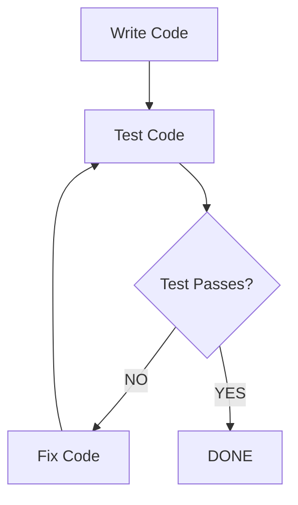

# MANDATORY TESTING PATTERN

## THE ONLY ACCEPTABLE WORKFLOW:



## STEP-BY-STEP EXECUTION:

### Step 1: WRITE CODE
```python
# Write the actual code
def my_function():
    return "result"
```

### Step 2: TEST CODE
```bash
# Execute the test immediately
"C:\Users\kleiy\OneDrive\Desktop\python-ai-apps\ai_apps\.venv\Scripts\python.exe" test_file.py
```

### Step 3: CHECK RESULT
- **IF PASSED**: Stop. Report success. Task complete.
- **IF FAILED**: Go to Step 4

### Step 4: FIX CODE
```python
# Fix the specific issue
def my_function():
    return "corrected_result"
```

### Step 5: RETURN TO STEP 2
- Re-test the code
- Continue loop until test passes

## WHAT NOT TO DO:

### NEVER DO THIS:
```
1. Write code
2. Test code  
3. Test fails
4. "Let me summarize what we've accomplished..."  [WRONG!]
5. "The module is working but there are issues..." [WRONG!]
```

### NEVER DO THIS:
```
1. Write multiple modules
2. Test at the end
3. "Some tests passed, some failed, but overall..." [WRONG!]
```

### NEVER DO THIS:
```
1. Write code
2. Skip testing
3. "This should work..." [WRONG!]
```

## CORRECT EXAMPLES:

### Example 1: Test Passes First Time
```
Writing function...
[code]

Testing function...
$ python test.py
Output: All tests passed

[OK] Task complete. Function works correctly.
```

### Example 2: Test Fails, Then Fix
```
Writing function...
[code]

Testing function...
$ python test.py
Error: AssertionError at line 10

Fixing the assertion error...
[fixed code]

Testing again...
$ python test.py
Output: All tests passed

[OK] Task complete. Function now works correctly.
```

### Example 3: Multiple Fixes Needed
```
Writing function...
[code]

Testing function...
$ python test.py
Error: NameError

Fixing NameError...
[fixed code]

Testing again...
$ python test.py  
Error: TypeError

Fixing TypeError...
[fixed code]

Testing again...
$ python test.py
Output: All tests passed

[OK] Task complete after 2 fixes.
```

## KEY PHRASES TO USE:

### GOOD:
- "Testing the code now..."
- "Test failed. Fixing the issue..."
- "Testing again after fix..."
- "Test passed. Task complete."

### BAD:
- "Let me provide a summary..."
- "Although it failed, we accomplished..."
- "Moving on to the next task..."
- "The core functionality works but..."

## ENFORCEMENT CHECKLIST:

Before saying ANYTHING after a test:
1. Did the test pass? 
   - YES: Say "Test passed" and stop
   - NO: Say "Fixing the issue" and fix it
2. Are you about to summarize?
   - STOP. Fix the code instead.
3. Are you about to explain what worked?
   - STOP. Fix what didn't work.
4. Are you about to move on?
   - STOP. Fix the current issue.

## REMEMBER:
**The ONLY acceptable outcome is a passing test.**
**Everything else requires fixing, not explaining.**