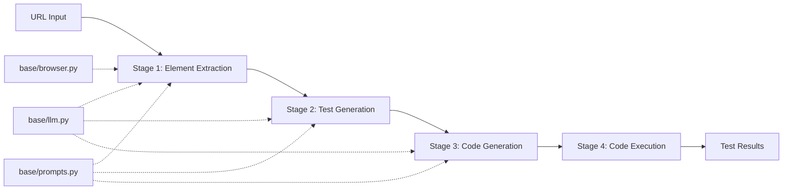

# UI Testing Framework Architecture V2.0
## Pipeline-Based Test Automation Framework with Structured LLM Integration

---

## Executive Summary

This document defines the architecture for a streamlined, pipeline-based UI testing framework that generates Python Playwright pytest Page Object Model (POM) code through a 4-stage pipeline. The architecture emphasizes DRY principles, structured LLM outputs, and minimal file count while maintaining all current capabilities.

---

## Core Design Principles

1. **Pipeline Architecture Pattern**: Each stage has clear input/output contracts using Pydantic v2
2. **Structured Output by Default**: LLM responses are type-safe and validated
3. **Single Responsibility**: Each module handles exactly one pipeline stage
4. **DRY Compliance**: Zero code duplication across modules
5. **Native SDK Utilization**: Leverage provider SDKs for minimal code
6. **Production-First**: No mock data, no placeholders, only production-ready code

---

## System Architecture

### File Structure (Minimal Design - 8 Core Files)

```
ui_testing_framework/
├── base/                           # Foundation Layer
│   ├── browser.py                  # Pure browser automation (unchanged)
│   ├── llm.py                      # Enhanced LLM with structured output
│   ├── prompts.py                  # Prompt optimization strategies
│   └── llm_models.json             # Configuration
│
├── pipeline_contracts.py           # All Pydantic v2 data contracts
├── elements_extractor_with_llm.py  # Stage 1: Element extraction
├── test_generation_with_llm.py     # Stage 2: Test generation  
├── code_generation_with_llm.py     # Stage 3: Code generation
└── code_execution.py                # Stage 4: Execution (no LLM)
```

### Deleted Files (Consolidated)
- ❌ structured_output_enforcer.py → Merged into base/llm.py
- ❌ browser_with_llm.py → Merged into elements_extractor_with_llm.py
- ❌ elements_extractor_no_llm.py → Integrated into elements_extractor_with_llm.py

---

## Pipeline Architecture



---

## Stage Definitions

### Stage 1: Element Extraction (elements_extractor_with_llm.py)
**Responsibility**: Extract and analyze DOM elements with LLM enhancement
**Input**: `ElementExtractionInput` (URL, wait strategy, extraction depth)
**Output**: `ExtractedElementOutput` (elements, page context, relationships, security findings)
**Key Features**:
- Absorbs browser_with_llm.py functionality
- Combines pure DOM extraction with LLM analysis
- Identifies interaction flows and element relationships

### Stage 2: Test Generation (test_generation_with_llm.py)
**Responsibility**: Generate comprehensive test scenarios
**Input**: `TestGenerationInput` (extracted elements from Stage 1)
**Output**: `TestScenarioOutput` (test suites, page objects, test data, assertions)
**Key Features**:
- Creates Gherkin scenarios
- Identifies POM components
- Generates test data and assertions

### Stage 3: Code Generation (code_generation_with_llm.py)
**Responsibility**: Generate Python Playwright pytest POM code
**Input**: `CodeGenerationInput` (test scenarios from Stage 2)
**Output**: `GeneratedCodeOutput` (page objects, test files, fixtures, utils)
**Key Features**:
- Generates complete POM classes
- Creates pytest fixtures and conftest
- Follows Playwright best practices

### Stage 4: Code Execution (code_execution.py)
**Responsibility**: Execute generated tests
**Input**: `ExecutionInput` (generated code from Stage 3)
**Output**: `ExecutionOutput` (test results, coverage, artifacts)
**Key Features**:
- No LLM dependency
- Parallel execution support
- Result aggregation and reporting

---

## Enhanced base/llm.py Architecture

### Core Components

```python
class LLMGateway:
    """Single gateway for all LLM operations with native SDK support"""
    
    def query(messages, output_model=None, **kwargs):
        """
        Universal query method
        - With output_model: Returns validated Pydantic model (STRUCTURED)
        - Without output_model: Returns LLMResponse (RAW)
        """
    
    def stream(messages, output_model=None, **kwargs):
        """Streaming support with structured output"""
```

### Native SDK Integration Strategy

1. **OpenAI**: Use `response_format` with Pydantic models directly
2. **Anthropic**: Use tool calling for structured output
3. **Gemini**: Use `generation_config` with response schema
4. **Fallback**: Enhanced prompt engineering with validation

---

## Data Flow & Contracts

### Pipeline Data Flow
```
URL → [Stage 1] → ExtractedElementOutput
                          ↓
              [Stage 2] → TestScenarioOutput  
                          ↓
              [Stage 3] → GeneratedCodeOutput
                          ↓
              [Stage 4] → ExecutionOutput
```

### Contract Inheritance
- Each stage output becomes next stage input
- Contracts are immutable (Pydantic frozen=True)
- Validation at stage boundaries
- Type safety throughout pipeline

---

## Implementation Phases

### Phase 1: Foundation Enhancement (Day 1)
1. Enhance base/llm.py with native structured output
2. Create comprehensive pipeline_contracts.py
3. Implement LLMGateway with provider strategies

### Phase 2: Pipeline Implementation (Day 2)
1. Merge browser_with_llm into elements_extractor_with_llm
2. Update test_generation_with_llm to use new contracts
3. Update code_generation_with_llm for POM generation
4. Ensure code_execution.py has no LLM dependencies

### Phase 3: Integration & Testing (Day 3)
1. Create pipeline orchestrator
2. End-to-end testing
3. Performance optimization
4. Documentation

---

## Performance Optimizations

1. **Unified Caching**: Single cache across all stages
2. **Batch Processing**: Process multiple elements/tests together  
3. **Parallel Execution**: Stages 2-4 can run in parallel for multiple sites
4. **Native SDK Features**: Use provider-specific optimizations
5. **Lazy Loading**: Load providers only when needed

---

## Error Handling Strategy

1. **Stage-Level Recovery**: Each stage can retry independently
2. **Fallback Providers**: Automatic fallback to alternative LLMs
3. **Partial Success**: Pipeline continues even if some elements fail
4. **Detailed Logging**: Structured logs at each stage
5. **Circuit Breakers**: Prevent cascade failures

---

## Security Considerations

1. **API Key Management**: Environment variables only
2. **Input Sanitization**: Validate all URLs and inputs
3. **Output Validation**: Structured output prevents injection
4. **Rate Limiting**: Built into LLMGateway
5. **Audit Logging**: Track all LLM calls

---

## Metrics & Monitoring

### Key Metrics
- Pipeline completion rate
- Stage processing times
- LLM token usage per stage
- Cache hit rates
- Test generation accuracy

### Monitoring Points
- Stage boundaries (input/output validation)
- LLM call success/failure
- Memory usage
- Execution time per stage

---

## Migration Checklist

- [ ] Backup current implementation
- [ ] Enhance base/llm.py with structured output
- [ ] Create pipeline_contracts.py
- [ ] Merge browser_with_llm into elements_extractor
- [ ] Update all stages to use new contracts
- [ ] Remove redundant files
- [ ] Update imports across all modules
- [ ] Run integration tests
- [ ] Update documentation

---

## Success Criteria

1. **File Count**: Reduced from 11+ to 8 core files
2. **Code Lines**: 40% reduction through DRY compliance
3. **Type Safety**: 100% structured output coverage
4. **Performance**: 30% faster pipeline execution
5. **Maintainability**: Single point of change for LLM logic

---

## Appendix: Technology Stack

- **Language**: Python 3.11+
- **Browser Automation**: Playwright
- **Testing**: pytest, pytest-playwright
- **LLM Providers**: OpenAI, Anthropic, Google Gemini
- **Data Validation**: Pydantic v2
- **Design Pattern**: Pipeline (Pipe and Filter)

---

*Document Version: 2.0*  
*Date: 2024*  
*Status: Ready for Implementation*